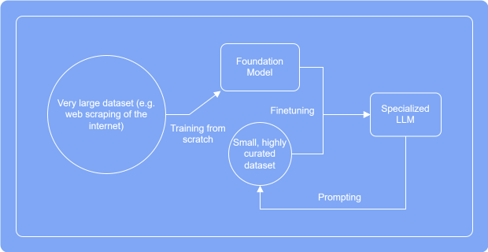
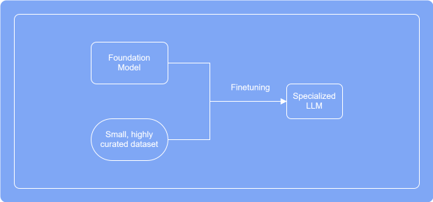
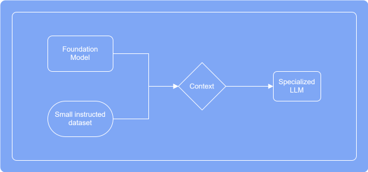
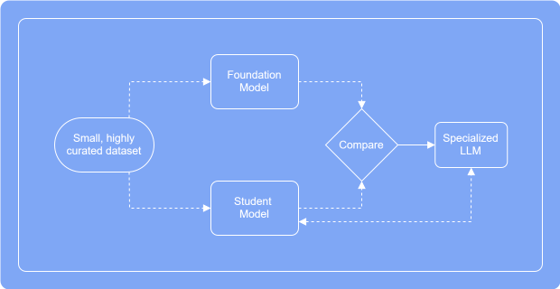
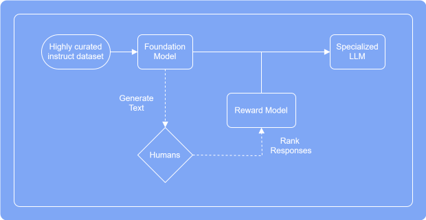
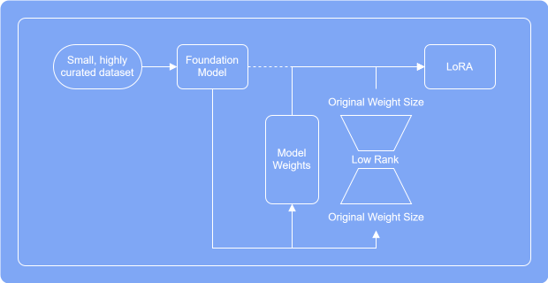

# Training-Large-Language-Models-Advanced-Techniques
---

1. **Training from Scratch**.

2. **Finetuning**.

3. **Prompt Training**.

4. **Knowledge Distillation**.

5. **Reinforcement Learning with Human Feedback (RLHF)**.

6. **Low Rank Adaptation (LoRA)**.

